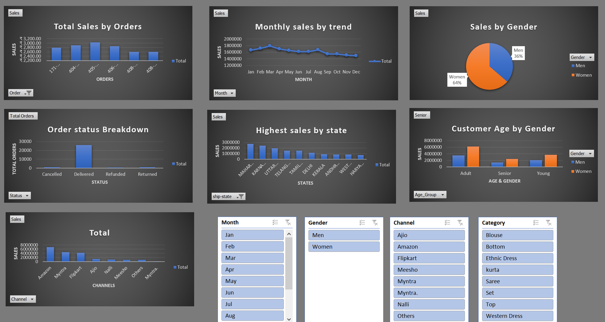

# Store Sales Analysis Dashboard

An interactive sales analytics dashboard built in Microsoft Excel to transform raw retail sales data into meaningful business insights. The project focuses on data cleaning, analysis, visualization, and dashboard creation to support data-driven decision-making.

## Project Overview

This project analyzes store sales data to identify customer purchasing behavior, sales trends, and product performance. The dashboard provides a clear and interactive view of key business metrics, enabling stakeholders to monitor performance and uncover actionable insights.

## Features

* Data Cleaning and Validation
* Customer Demographics Analysis
* Sales Trend Analysis
* State-wise Performance Analysis
* Product Category Analysis
* Interactive Dashboard with Filters
* Business Insights and Reporting

## Tech Stack

* Microsoft Excel
* Pivot Tables
* Pivot Charts
* Slicers
* Data Visualization

## Dashboard Insights

* Sales by Gender
* Sales by Age Group
* Top Performing States
* Product Category Performance
* Monthly Sales Trends
* Customer Purchase Behavior

## Project Workflow

Raw Data → Data Cleaning → Data Processing → Pivot Tables → Visualizations → Interactive Dashboard

## Key Learnings

* Data Cleaning and Preparation
* Exploratory Data Analysis (EDA)
* Dashboard Design Principles
* Business Intelligence Reporting
* Data Visualization Techniques

## Dashboard Preview

## Business Value

The dashboard helps businesses understand customer behavior, identify high-performing products, track sales trends, and make informed business decisions based on data.
